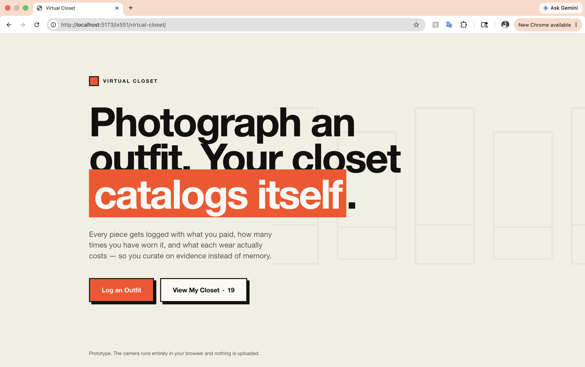
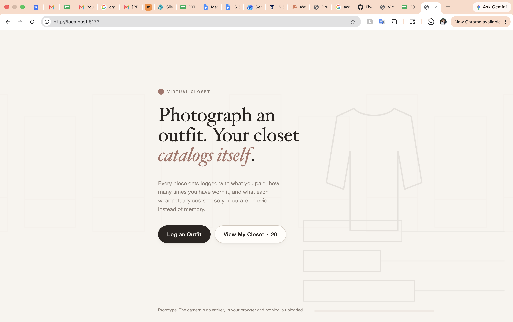
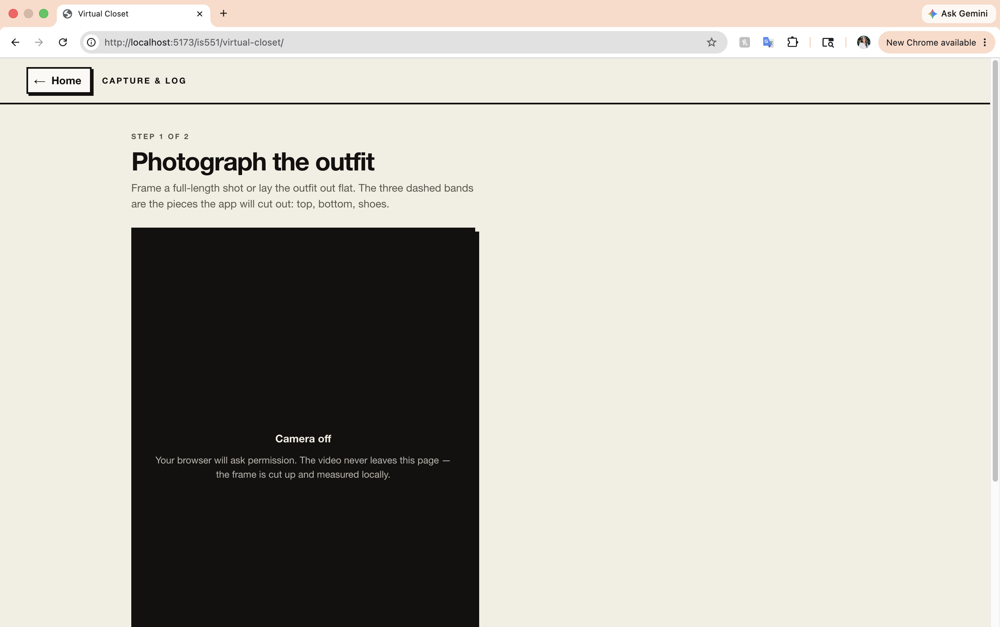
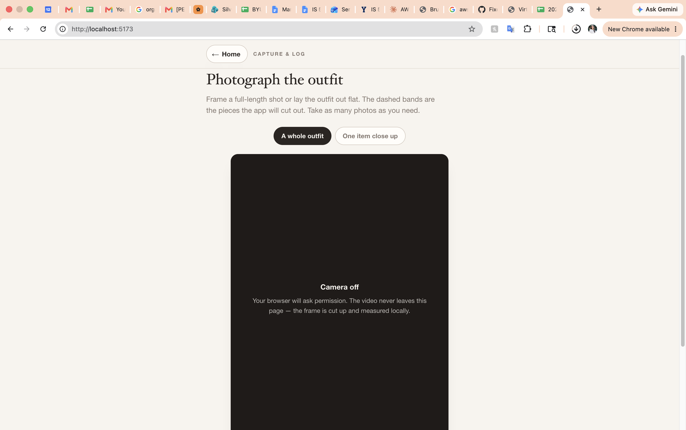
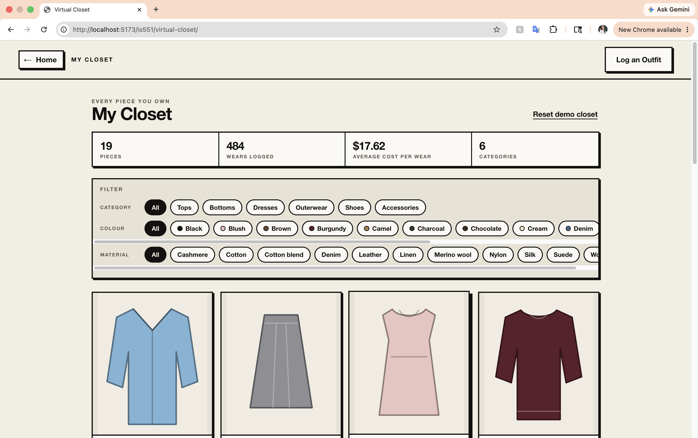
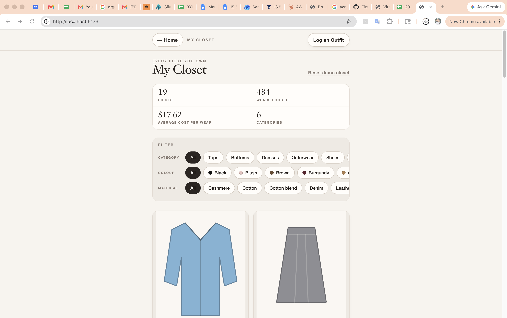

# Virtual Closet — First Three Screens Prototype

A virtual closet cataloging mock-up. Photograph an outfit, get it broken into pieces
with guessed attributes, confirm or correct them, and browse the growing closet as a
grid with cost-per-wear tracking.

- **Live demo:** https://is551.senahpark.com/virtual-closet/
- **Repository:** https://github.com/senahpomaikai/virtual-closet

> Built mobile-first. Open the live demo on a phone, or narrow a desktop browser, to
> see it as intended. The camera on Screen 2 needs HTTPS, which the live URL provides;
> `localhost` also works during development.

---

## 1. Need, Persona, Capability, Value

- **Need:** To keep track of closet usage, fashion aficionados must rely on memory or
  a very complex and manual spreadsheet.
- **Persona:** Intentionally shops for and invests in articles of clothing, cares
  about "cost per wear" (a metric used to determine the utility of an article of
  clothing), wants to understand their personal style better.
- **Capability:** Keep track of items in closet virtually.
- **Fundamental Value:** Curation. The user is better able to select and understand
  their closet to be able to curate their style into who they want to be.

## 2. The Three Screens

| Screen | Job | Why It Earned a Slot | Design Question |
|--------|-----|----------------------|------------------|
| Landing | Signal the core value and primary capability at a glance | First and only chance to hook the persona before they decide whether to explore | Does the value land before the user reads anything? |
| Capture & Log | Demonstrate the primary capability in action | Shows the app actually doing the work the persona currently does by memory/spreadsheet | Does the capability feel fast and low-effort? |
| Virtual Closet | Demonstrate the payoff of accumulated data | Shows *why* logging outfits matters — curation only shows up once there's a closet to curate | Does the payoff feel real once items accumulate? |

## 3. Feedback Question Plan

| Question (as I'd say it) | Predicted answer | What the prediction rests on |
|---|---|---|
| **(Need)** How do you keep track of your closet currently, and what is your experience with your process? | I use a Google Sheet to keep track of everything. It gets the job done but it is very tedious to manage, especially if I fall behind on logging my outfits because I input everything manually. | Not a prototype feature, but the feature most contingent on the answer: photo capture plus automatic item detection, which exists to cut the manual effort the spreadsheet demands. |
| **(Value)** If there was a way to manage your closet virtually, what are one or two words that describe the value you see, and why? | Visual representation, convenient | Screen 3, the closet grid: one photo per piece, filterable, with per-item metrics on every tile. |
| **(Persona)** As a fashion enthusiast, what are other ways you have thought about or seen other people manage their closets? | Cher's outfit generator from *Clueless*, or just a photo album of daily outfits on a phone. | Every closet item carries a photo, so the closet reads as an album rather than a table. |
| **(Capability)** What part of this app would you explore first, and what would you expect would happen? | The "Log an Outfit" button stands out with the dark background, so I'd click that first. I'd expect it to let me add each individual piece of my outfit, with a photo. | Screen 2: capture the outfit as one photo, then break it down piece by piece. |

Each prediction is falsifiable against a specific screen, which is the point. The
Capability prediction is the sharpest test in the set: it predicts both *which*
control draws the eye first and *what* the user expects behind it, so a wrong answer
tells me whether the failure was signaling or comprehension.

---

## 4. Design Justification & First Read

Written after opening the live URL cold, on a phone, as if seeing it for the first
time.

### Does the landing screen signal the capability and the value before reading?

The capability, mostly yes. The value, not yet.

What registers before a single word is parsed: one dominant block of serif type, two
stacked buttons with a clear primary, and a faint animation that cycles a garment
being scanned into a rail of drifting tiles. That silhouette-then-rail shape reads as
"clothing" and "a collection of it" pre-literately, which is the capability.

Curation and cost per wear do not survive that same pre-reading glance. They live in
the subhead, one step down the hierarchy. This is a real limit and I left it rather
than papering over it, because the alternative — putting a number or a metric in the
hero — would have made the screen read as a finance tool rather than a wardrobe. The
Value question in Section 3 is aimed squarely at this gap.

### Does every element earn its place?

Audited element by element, and two failed.

The **background animation** was the first failure. In the initial build it sat at
16% opacity with outlined bars running directly behind the subhead, so the smallest
copy on the screen competed with decoration. Moved to the right of the text column,
then dropped to 9% with thinner strokes. It now illustrates without competing.

The **orange accent** was the second and worse one. The initial landing set the
phrase "catalogs itself" in white on a solid orange block. The eye went to the orange
rectangle, not the sentence — the accent had become the figure and the headline the
ground. It is now italic serif in a muted clay, which emphasizes the clause rather
than replacing it.

Three elements earn their place on inspection. The **item count on the "View My
Closet" button** signals accumulation, which is the entire premise of Screen 3. The
**camera footnote** appears before any permission prompt, which is where a
reassurance about uploads actually reduces hesitation. The **wordmark** does the
minimum work of naming the thing.

### What belongs together on each screen, and which Gestalt principle says so

**Screen 1.** The two buttons form one group by proximity and similarity: adjacent,
identical pill shape, identical size. Priority between them comes from figure and
ground — one filled with ink, one outlined — rather than from color, so the primary
path is legible without relying on hue.

**Screen 2.** Each detected piece is a single card: common region. Inside a card, the
origin label, thumbnail, and name cluster above the form by proximity, so you know
*what* you are editing before you see *what about it*. Provenance uses similarity:
every chip is the same shape, and only the fill differs, so "measured" versus "guess"
reads at a glance without a legend. The strongest grouping decision on this screen is
that the dashed bands drawn on the live viewfinder are the exact rectangles the app
cuts on. The guide and the result are the same region, so the segmentation is
predicted before the shutter fires rather than explained afterward.

**Screen 3.** The filter block is one tinted, rounded, bordered panel: common region,
separating controls from the content they act on. Within it, each facet is its own
labelled row (proximity) and every control is the same pill (similarity). On a tile,
the two metrics sit together beneath a hairline rule, apart from the name, so cost
per wear and wear count read as one compound fact instead of trailing off the title.

### Do Screens 2 and 3 stay on mission, and can you get home from everywhere?

Home, yes. Every screen past the landing carries the same control, in the same
corner, in a bar that stays put while the page scrolls. The save confirmation on
Screen 2 offers a third route home on top of that.

Mission, with one tension worth naming. Screen 3 stays clean: stat strip, filters,
grid, and every tile carries the payoff metric. Screen 2 is where the revision round
pushed hardest against the original design question, *does the capability feel fast
and low-effort?* The review form now runs to eight fields per piece. Three mitigations
hold it together: every field arrives pre-filled, only the duplicate question blocks
saving, and the fields the user must actually think about sit at the top of the card.
Whether that is enough is the single most important thing to watch in testing.

### What the AI got wrong, skipped, or oversimplified

Everything below is a change I directed after reviewing the first build. The initial
commit is [`f43db0b`](https://github.com/senahpomaikai/virtual-closet/commit/f43db0bcf2995ebfde149a238133f83d07c9cc40)
and the revisions landed through [pull request #1](https://github.com/senahpomaikai/virtual-closet/pull/1),
one commit per change.

**It built for a desktop.** A 1180px page with a four-across closet grid, despite the
brief specifying two-by-x. *Design decision that motivated the change:* recognition.
A closet is scanned by silhouette, and four garments across a phone renders each one
too small to recognize, which defeats the only job that screen has. Now a single
phone-width column at every viewport, two tiles across.
[`0a680da`](https://github.com/senahpomaikai/virtual-closet/commit/0a680da5ddd8098b4db554b7b8eb91b5637c0e76)

**The interface out-shouted the clothes.** Hard black rules, solid offset shadows, and
a saturated orange meant the loudest thing on a screen full of garments was the
chrome around them. *Design decision:* figure and ground. In an app about clothing,
the most saturated thing in view should be an item of clothing. Bone and warm greige
now, hairline borders, soft shadows, serif display type, and the accent reduced to
three appearances in the entire app.
[`8985f3a`](https://github.com/senahpomaikai/virtual-closet/commit/8985f3abd04da9a23668fc3b060470772a277ce6)

**Detection stopped at three body bands.** Top, bottom, shoes — structurally unable to
log a hat, a bag, or a necklace. *Design decision:* the capability claim is "keep
track of items in closet," and an app that cannot represent a handbag quietly
contradicts it. Added a head band, batches that accumulate across multiple photos, a
close-up mode that logs one frame as one piece, and a manual add for anything a camera
cannot see.
[`aba985f`](https://github.com/senahpomaikai/virtual-closet/commit/aba985fd24c0bb31fbaa66fb2689e5a041d60e0a)

**It only captured what a machine can guess.** Color, type, material, size — and none
of brand, a name in the user's own words, or purchase date. *Design decision:* the
persona identifies pieces by brand and by what they call them, not by a color-plus-
fiber string, and cost per wear over time is meaningless without a purchase date.
All three added, with the user-supplied fields placed first on the card.
[`9366787`](https://github.com/senahpomaikai/virtual-closet/commit/9366787e69e0f88cafc602bd522af6d2697be1c9)

**The viewfinder was left-justified.** *Design decision:* aiming a camera is a
centering act, and a frame hanging off one edge fights it. Centered, with its controls
beneath it on the same axis.
[`2620774`](https://github.com/senahpomaikai/virtual-closet/commit/2620774c1a5fa6bde8161815e99d1524ba7d7823)

Two further corrections happened before the first commit, while the build was being
specified.

**The spec called for MobileNet to guess garment type.** ImageNet has almost no
garment vocabulary, so on a webcam frame of a dressed person it returns confident
nonsense. Replaced with a position prior: the app already cuts the frame into bands,
and where a piece sits predicts its type far more reliably than a classifier does on
a low-resolution crop, at the cost of no dependency and no model download. Color, the
one attribute that can honestly be measured, is computed from the actual pixels in
CIE Lab.

**The spec assumed the app could be hosted at `senahpark.com/is551/`.** The apex
domain resolves to a CloudFront distribution outside the AWS account in use, so no
path can be attached to it from there. The app lives at `is551.senahpark.com` instead,
on its own distribution with its own certificate, which leaves the existing site
untouched. HTTPS is not cosmetic here: the camera does not run without it.

Serving from a subpath then produced its own bug. The build originally used a relative
asset base, which looks portable and works at `/virtual-closet/` but renders a blank
page at `/virtual-closet` with no trailing slash: the browser resolves `./assets/…`
against the domain root and both files 404. Vite's `base` is now the absolute deploy
path, so asset URLs no longer depend on how the page URL happens to be spelled.

### Before and after

Both states shot at the same browser width, so the difference is the design rather
than the window. Before is the initial commit
[`f43db0b`](https://github.com/senahpomaikai/virtual-closet/commit/f43db0bcf2995ebfde149a238133f83d07c9cc40);
after is the merged revision branch. To reproduce the left column, run
`git checkout f43db0b && npm run dev`, then return with `git checkout main`.

#### Screen 1 — Landing

| Before | After |
|---|---|
|  |  |

The headline is the same sentence in both, which makes the treatment the only
variable. Before, "catalogs itself" is reversed out of a solid orange block, and the
eye goes to the rectangle rather than the clause — the accent became the figure and
the sentence the ground. After, the same clause is italic serif in a muted clay, so
the emphasis lives inside the sentence. Note also what happened to weight: two hard
black-bordered buttons with solid offset shadows became one ink pill and one outlined
pill, which reads the priority faster with less ink on the page.

#### Screen 2 — Capture & Log

| Before | After |
|---|---|
|  |  |

Before, the viewfinder hangs off the left edge while the copy above it runs the full
width, and the only thing the screen can do is cut a photo into three bands. After,
the frame sits on the centre axis — aiming a camera is a centring act — and a mode
switch sits directly above it, because what you are photographing decides how the
frame gets cut. That control is the visible half of the accessories work: "one item
close up" is what makes a handbag or a necklace loggable at all.

#### Screen 3 — Virtual Closet

| Before | After |
|---|---|
|  |  |

The starkest pair. Before, four garments across a wide page, each one small, inside
heavy black frames that draw more attention than the clothes they contain. The stat
strip is four cells wide and the filter panel spans the full width, so the eye has no
column to follow. After, two across in a phone-width column, stats folded two by two,
and every border reduced to a hairline. The garments are now the most saturated thing
in view, which is the whole point of a screen whose job is recognising what you own.

---

## Tech Stack

- Vite + React + TypeScript
- Client-side only. No backend, no auth, no accounts
- No runtime dependencies beyond React, and no client-side router — screens switch on
  in-app state, which avoids deep-link rewriting on S3 and leaves no router basename to
  keep in step with the deploy path
- Color is measured from captured pixels via canvas `getImageData`, converted to CIE
  Lab for naming and for the duplicate-detection distance. Type is inferred from
  position in the frame. Material and size are labelled placeholders, never presented
  as fact
- Garment previews for seeded items are inline SVG silhouettes, so the demo has no
  remote image dependencies
- Session state persists to `localStorage`; Screen 3 has a reset control

## Running Locally

```bash
npm install
```

```bash
npm run dev
```

## Deployment

Static build published to `s3://is-551/virtual-closet/` and served through CloudFront
at `is551.senahpark.com`, with Origin Access Control so the bucket itself stays
private. The subdomain has its own ACM certificate in `us-east-1` and A and AAAA alias
records in the existing Route 53 zone, which leaves the apex domain and the site
already on it untouched. A CloudFront viewer function maps directory URLs onto
`index.html`, since S3 has no concept of an index document.

A GitHub Actions workflow builds, syncs, and invalidates on every push to `main`. It
needs `AWS_ACCESS_KEY_ID` and `AWS_SECRET_ACCESS_KEY` repo secrets from a scoped IAM
user whose policy is checked in at
[`docs/deploy-iam-policy.json`](docs/deploy-iam-policy.json).

## Commit History Note

The initial commit
([`f43db0b`](https://github.com/senahpomaikai/virtual-closet/commit/f43db0bcf2995ebfde149a238133f83d07c9cc40))
is the AI agent's first output, unmodified. The revisions described in Section 4
landed as five separate commits through
[pull request #1](https://github.com/senahpomaikai/virtual-closet/pull/1), one per
change, so each design decision can be read against its diff.
